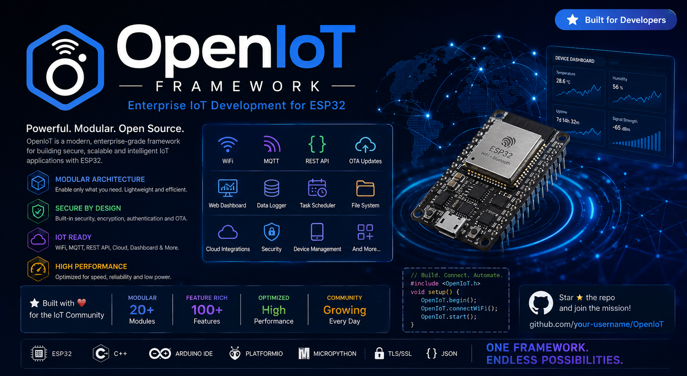

<div align="center">


# 🌐 OpenIoT Framework

### A Modern, Modular & Production-Ready IoT Framework for ESP32 & ESP8266

[](LICENSE)
[](https://github.com/gmostofabd/OpenIoT/releases)
[](https://github.com/gmostofabd/OpenIoT/stargazers)
[](https://github.com/gmostofabd/OpenIoT/network)
[](https://github.com/gmostofabd/OpenIoT/issues)

**Build • Connect • Automate • Scale**

</div>

---


\[!\[License](https://img.shields.io/github/license/gmostofabd/OpenIoT?style=for-the-badge)](LICENSE)

\[!\[Release](https://img.shields.io/github/v/release/gmostofabd/OpenIoT?style=for-the-badge)](../../releases)

\[!\[GitHub Stars](https://img.shields.io/github/stars/gmostofabd/OpenIoT?style=for-the-badge)](../../stargazers)

\[!\[Forks](https://img.shields.io/github/forks/gmostofabd/OpenIoT?style=for-the-badge)](../../network)

\[!\[Issues](https://img.shields.io/github/issues/gmostofabd/OpenIoT?style=for-the-badge)](../../issues)

\[!\[Pull Requests](https://img.shields.io/github/issues-pr/gmostofabd/OpenIoT?style=for-the-badge)](../../pulls)





\*\*Designed for developers, engineering students, researchers, educators, and industrial IoT applications.\*\*


</div>


\---


\# 📖 About OpenIoT


OpenIoT Framework is a \*\*professional modular IoT framework\*\* built for \*\*ESP32\*\* and \*\*ESP8266\*\*, designed to simplify the development of connected embedded systems.


Unlike traditional Arduino projects where every application is developed independently, OpenIoT provides a \*\*structured, reusable, scalable, and production-ready architecture\*\* that allows developers to focus on building applications instead of rewriting infrastructure.


The framework combines modern software engineering practices with embedded development, making it suitable for:


\- Academic projects

\- Research laboratories

\- Industrial automation

\- Smart agriculture

\- Smart homes

\- Smart cities

\- Energy monitoring

\- Cloud-connected devices

\- Commercial IoT products


\---


\# ✨ Features


\- Modular architecture

\- Plug-and-play modules

\- Automatic initialization

\- Built-in Logger

\- Configuration Manager

\- File System Manager

\- Wi-Fi Manager

\- Web Server

\- REST API

\- MQTT Client

\- OTA Updates

\- Scheduler

\- JSON Utilities

\- NTP Time Synchronization

\- Dashboard Integration

\- Cloud Ready

\- Secure Architecture

\- GitHub OTA Updates

\- Low Memory Footprint

\- ESP32 \& ESP8266 Support

\- Easy Library Integration

\- Beginner Friendly

\- Production Ready


\---


\# 🏗 Framework Architecture


```

Application

&#x20;     │

&#x20;     ▼

OpenIoT Framework

&#x20;     │

&#x20;├── Core

&#x20;├── Config

&#x20;├── Logger

&#x20;├── Storage

&#x20;├── Scheduler

&#x20;├── WiFi

&#x20;├── OTA

&#x20;├── MQTT

&#x20;├── HTTP

&#x20;├── REST API

&#x20;├── Dashboard

&#x20;├── Security

&#x20;└── Cloud

&#x20;     │

&#x20;     ▼

ESP32 / ESP8266 Hardware

```


\---


\# 🚀 Quick Start


\## Installation


Clone the repository


```bash

git clone https://github.com/gmostofabd/OpenIoT.git

```


or download the latest release from


```

Releases

```


\---


\## Basic Example


```cpp

\#include <OpenIoT.h>


void setup()

{

&#x20;   Serial.begin(115200);


&#x20;   OIF::Framework.begin();

}


void loop()

{

&#x20;   OIF::Framework.run();

}

```


\---


\# 📂 Repository Structure


```

OpenIoT/


├── examples/

│

├── docs/

│

├── src/

│

│   ├── Core

│   ├── Logger

│   ├── Config

│   ├── WiFi

│   ├── OTA

│   ├── MQTT

│   ├── REST

│   ├── Dashboard

│   ├── Storage

│   └── Scheduler

│

├── assets/

│

├── website/

│

├── test/

│

├── library.properties

│

└── README.md

```


\---


\# 📚 Documentation


| Topic | Description |

|--------|-------------|

| Getting Started | Installation and setup |

| Architecture | Framework internals |

| Core Module | Framework lifecycle |

| Logger | Logging system |

| Configuration | Configuration management |

| WiFi | Network manager |

| OTA | Firmware updates |

| Dashboard | Web dashboard |

| REST API | REST services |

| MQTT | MQTT communication |

| Storage | SPIFFS/LittleFS |

| Scheduler | Task scheduling |

| Security | Authentication |


Documentation:


```

docs/

```


Website:


```

https://gmostofabd.github.io/OpenIoT/

```


\---


\# 💻 Examples


The framework includes beginner to advanced examples.


```

examples/


├── Blink

├── Logger

├── WiFi

├── Dashboard

├── MQTT

├── OTA

├── REST

├── Scheduler

├── Sensors

├── SmartHome

├── SmartAgriculture

├── Industrial

└── Cloud

```


\---


\# 📦 Modules


| Module | Status |

|---------|--------|

| Core | ✅ |

| Logger | ✅ |

| Config | ✅ |

| Scheduler | 🚧 |

| Dashboard | 🚧 |

| OTA | 🚧 |

| MQTT | 🚧 |

| REST | 🚧 |

| Storage | 🚧 |

| Cloud | 🚧 |


\---


\# 🌍 Supported Platforms


\- ESP32

\- ESP32-S2

\- ESP32-S3

\- ESP32-C3

\- ESP8266


\---


\# 🔧 Development Roadmap


\### Version 1


\- Core

\- Logger

\- Config


\### Version 2


\- OTA

\- Dashboard

\- Scheduler


\### Version 3


\- MQTT

\- REST API

\- Cloud Integration


\### Version 4


\- AI Assistant

\- Device Provisioning

\- Mobile Application


\---


| Example | Source              | Firmware                                                            |
| ------- | ------------------- | ------------------------------------------------------------------- |
| Blink   | `examples/01_Blink` | [Download BIN](examples/01_Blink/firmware/OpenIoT_Blink_v1.0.0.bin) |
| WiFi    | `examples/02_WiFi`  | [Download BIN](examples/02_WiFi/firmware/OpenIoT_WiFi_v1.0.0.bin)   |
| OTA     | `examples/07_OTA`   | [Download BIN](examples/07_OTA/firmware/OpenIoT_OTA_v1.0.0.bin)     |


\# 🤝 Contributing


Contributions are welcome.


1\. Fork the repository


2\. Create a feature branch


```bash

git checkout -b feature/MyFeature

```


3\. Commit your changes


```bash

git commit -m "Added awesome feature"

```


4\. Push


```bash

git push origin feature/MyFeature

```


5\. Open a Pull Request


\---


\# 🐞 Bug Reports


Please create an issue describing:


\- Framework Version

\- Board Model

\- Arduino IDE Version

\- PlatformIO Version

\- Operating System

\- Error Log

\- Steps to Reproduce


\---


\# 📈 Project Goals


\- Professional IoT Framework

\- Educational Platform

\- Industrial Applications

\- Open Source Community

\- Cloud Integration

\- Modern Embedded Development


\---


\# 🎓 Perfect For


\- Engineering Students

\- University Projects

\- Research Labs

\- IoT Developers

\- Embedded Engineers

\- Industrial Automation

\- Robotics

\- Smart Agriculture

\- Smart Buildings


\---


\# 📄 License


Released under the \*\*MIT License\*\*.


See:


```

LICENSE

```


\---


\# 👨‍💻 Author


\*\*Md. Golam Mostofa\*\*


Embedded Systems Engineer


IoT Developer


Open Source Contributor


\---


\# ⭐ Support the Project


If OpenIoT helps your work, consider:


⭐ Star the repository


🍴 Fork the project


🛠 Contribute new modules


📖 Improve the documentation


🐞 Report bugs


💡 Suggest new features


\---


<div align="center">


\# OpenIoT Framework


\### Build Once. Connect Everything.


\*\*Made with ❤️ for the Embedded \& IoT Community\*\*


</div>


